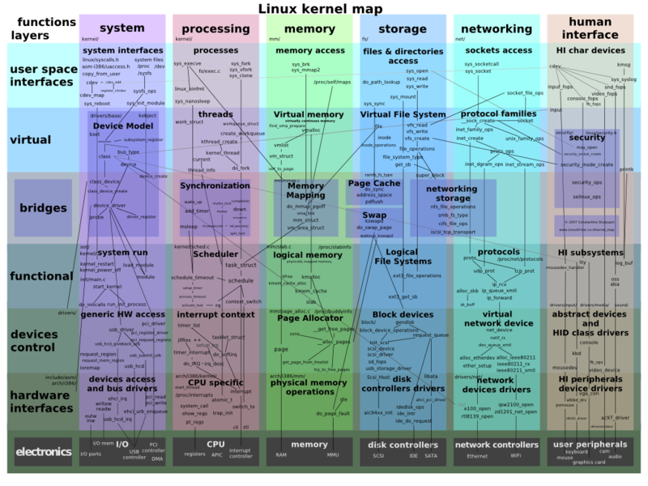

# **Curso Docker**

Entendendo e trabalhando com containers utilizando docker

## Paulo Canedo C Rodrigues

---

# Conteúdo Previsto

- Conceitos
- Instalação
- Construir uma imagem
- Volumes
- Redes
- Docker Compose
- Melhores Práticas
- Exemplo completo
- Ferramentas auxiliares

---

# Um pouco de história

---

# O que é um container?

## Tudo começou com um chroot

Se você é familiar com _chroot_, pense em um container como uma versão estendida do _chroot_. O sistema de arquivos está simplesmente vindo da imagem. Mas um container adiciona isolação extra não disponível quando está usando apenas o _chroot_.

---

# Mapa do kernel linux

---

# Vamos falar mais sobre isolamento
## kernel namespaces

- Mount (mnt)
- UNIX Time-sharing System (uts)
- Interprocess Communication (ipc)
- Process ID (pid)
- Network (net)
- User id (uid)
- Control Group (cgroup)

--- 

# E o que é o docker?

- Docker Engine
  - API
  - CLI
- Docker Compose
- Docker Swarm
- Docker HUB

---

# Vantagens

- custos
- portabilidade
- fácil manutenibilidade
- altamente escalável
- distribuição melhor de recursos

---

# Desvantagens

- executa em apenas um sistema operacional
- um pouco mais lento do que bare-metal
- difícil ser aplicado em sistemas monolíticos
- isolamento menor do que VM
- persistência de dados é mais complicada
- interface gráfica não funciona bem (ainda, talvez?)

---

# Instalação

- Linux
- Windows
- Mac OS

Jetbrains IDEs VSCode

---

# Primeiros passos

- docker run [--it]
- docker pause
- docker unpause
- docker port
- docker kill
- docker start
- docker stop
- docker top
- docker inspect

---

# Entendendo os termos mais comuns

- Imagem
- Container
- Host (Máquina hospedeira)

---

# Sistema de Arquivos do container

---

# Múltiplos containers com mesma imagem

---

# Construindo sua imagem

- Dockerfile
  - \# syntax=builder
  - FROM
  - RUN
  - CMD
  - LABEL
  <!-- - EXPOSE -->
  <!-- - ENV -->
  <!-- - ADD -->
  - COPY
  <!-- - ENTRYPOINT -->
  <!-- - VOLUME -->
  <!-- - USER -->
  - WORKDIR
  <!-- - ARG -->

---

# Construção com estágios múltiplos

---

# Volumes

---

# Network

---

# Referências bibliográficas

- https://docs.docker.com/get-started/
- https://medium.com/@saschagrunert/demystifying-containers-part-i-kernel-space-2c53d6979504
- https://kubernetes.io/docs/concepts/overview/
https://docs.docker.com/storage/storagedriver/
https://docs.docker.com/storage/volumes/
https://docs.docker.com/build/building/multi-stage/